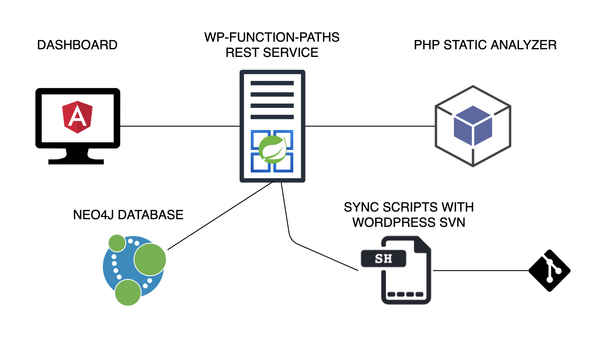
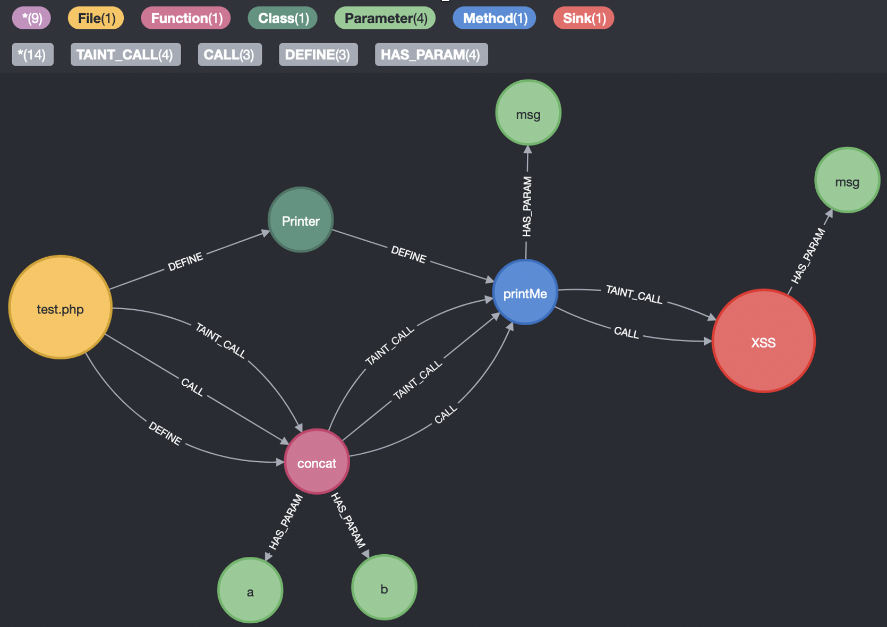
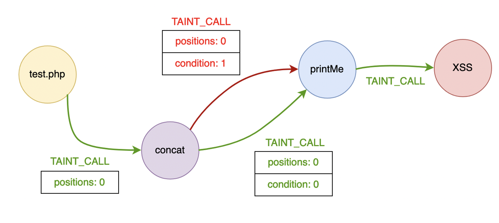

# wp-function-paths-app
Static code analyzer for WordPress plugins

## Motivation

This tool is part of a challenge proposed by Telefónica. The goal of this tool is to
support the static analysis of WordPress plugins in order to find 0-day vulnerabilities.

## The architecture



The application is containerized with docker-compose to allow an easy deployment.
The architecture has 5 main components:

  * The graphical interface or dashboard where plugins can be downloaded, imported and 
    analyzed. The frontend uses Angular.
  * The REST API that manages plugins and starts the analysis. The API is built using Spring Boot
    framework.
  * The PHP static analyzer that performs the static analysis using [PHP-Parser](https://github.com/nikic/PHP-Parser).
  * Some bash scripts to synchronize with the SVN repo.
  * The Neo4j database to store plugin information and the analysis results.

## A brief explanation of the static analyzer

The static analysis is mainly performed by the PHP module. The REST API just calls
the PHP module and then deals with the results to prepare data to be inserted in Neo4j.

The PHP static analyzer has some utilities called Visitors that extend from the NodeVisitorAbstract
from PHP-Parser. These Visitor utilities traverse the AST (Abstract Syntax Tree) nodes generated by
PHP-Parser tool. During this traversal some actions are taken depending on the Visitor, there are
Visitors. There are 5 visitors:

1.	**ClassVisitor**: Extracts information from classes and also class like entities (traits/interfaces).
2.	**FunctionVisitor**: Extracts information about functions and uses the TaintVisitor to perform a taint analysis 
      for that function.
3.	**MethodVisitor**: Extracts information about methods and uses the TaintVisitor to perform a taint analysis
      for that method.
4.	**HookVisitor**: Extracts WordPress hooks but just those that don't have dynamic names (those using variables).
5.	**TaintVisitor**: Applies a taint analysis for one of the following contexts: file, function or method.

It is important to take into account that the taint analysis performed by this tool is just a simple approach and
it isn't as precise as any other dedicated tools for this purpose.

The idea behind this taint analysis is to determine if a direct taint value (a value controlled directly by the user) 
reaches any other function. Also, it determines what would happen if a function or method parameter where tainted.

Once the analysis is done, a call graph is stored in Neo4j looking like the following:



TAINT_CALL relationships are the most important information of these graphs. Those relationships
mean that it could be possible to perform a taint call between two different nodes.

To extract the real vulnerabilities we need to take into account some attributes stored inside the TAINT_CALL 
relations. 

* **positions**: Positions of the target function/method that are tainted in that tainted call. 
* **condition**: Position of the source function/method that needs to be tainted for the tainted call to be satisfied. 

So, as it is shown in the next diagram, the correct path is that one where all conditions are met.



With the previous setup we could just extract interesting information from the Neo4j database. The following
queries are a good way to extract the tainted paths that end in an insecure function.
These queries basically check that all TAINT_CALL conditions are met.

### Level 1 (Takes into account all sanitizers)
```
//Vuln L1 (All sanitizers)
MATCH taintedPath=(source)-[:TAINT_CALL*1..]->(sink:Sink)
WHERE 
    source.isControlledByUser = true
AND NONE
    (
        n IN nodes(taintedPath) WHERE
            EXISTS (n.sanitizers) AND
            (
                'ALL' IN n.sanitizers OR
                sink.vulnerability IN n.sanitizers
            )
    )
AND ALL(
    idx IN range(0,length(taintedPath)-2)
    WHERE relationships(taintedPath)[idx+1].condition 
        IN relationships(taintedPath)[idx].positions
        OR
        NOT EXISTS(relationships(taintedPath)[idx+1].condition)
)
OPTIONAL MATCH definers=(definer)-[:DEFINE*1..2]->(source)
OPTIONAL MATCH sourceHooks=(hookSource)-[:TRIGGER]->(source)
RETURN sourceHooks, definers, taintedPath
```

### Level 2 (Takes into account specific sanitizers)
```
//Vuln L2 (Specific sanitizers)
MATCH taintedPath=(source)-[:TAINT_CALL*1..]->(sink:Sink)
WHERE 
    source.isControlledByUser = true
AND NONE
    (
        n IN nodes(taintedPath) WHERE
            EXISTS (n.sanitizers) AND
            sink.vulnerability IN n.sanitizers
    )
AND ALL(
    idx IN range(0,length(taintedPath)-2)
    WHERE relationships(taintedPath)[idx+1].condition 
        IN relationships(taintedPath)[idx].positions
        OR
        NOT EXISTS(relationships(taintedPath)[idx+1].condition)
)
OPTIONAL MATCH definers=(definer)-[:DEFINE*1..2]->(source)
OPTIONAL MATCH sourceHooks=(hookSource)-[:TRIGGER]->(source)
RETURN sourceHooks, definers, taintedPath
```


### Level 3 (No sanitizers are taken into account)
```
//Vuln L3 (NO sanitizers)
MATCH taintedPath=(source)-[:TAINT_CALL*1..]->(sink:Sink)
WHERE 
    source.isControlledByUser = true
AND ALL(
    idx IN range(0,length(taintedPath)-2)
    WHERE relationships(taintedPath)[idx+1].condition 
        IN relationships(taintedPath)[idx].positions
        OR
        NOT EXISTS(relationships(taintedPath)[idx+1].condition)
)
OPTIONAL MATCH definers=(definer)-[:DEFINE*1..2]->(source)
OPTIONAL MATCH sourceHooks=(hookSource)-[:TRIGGER]->(source)
RETURN sourceHooks, definers, taintedPath
```

## Usage

To use this tool you'll need to install first `maven` and `docker`. Once you've both tools installed the 
process to run `wp-function-paths` is the following:

1. Go to `wp-function-paths` folder and run `mvn install` to generate the Java artifact.
2. Go to the repo root folter and run `docker-compose up -d`. This could take some minutes while it 
downloads all required dependencies and builds the docker images.

Optional steps to setup a `WordPress` instalation locally to install and test plugins:
1. Go to `wordpress` folder and run `docker-compose up -d`.

Both `WordPress` and `wp-function-paths` docker containers share the same `plugins` directory. All
uploaded plugins to `wp-function-paths` will be also available to install in `WordPress`.

| :warning: WARNING          |
|:---------------------------|
| When uploading a new plugin to `wp-function-paths` ensure the source code is directly in the root of the ZIP file. If that's not the case you won't be able to install directly the `WordPress` plugin |

# License

Copyright 2021 Bruno López Trigo

Licensed under the Apache License, Version 2.0 (the "License");
you may not use this file except in compliance with the License.
You may obtain a copy of the License at

http://www.apache.org/licenses/LICENSE-2.0

Unless required by applicable law or agreed to in writing, software
distributed under the License is distributed on an "AS IS" BASIS,
WITHOUT WARRANTIES OR CONDITIONS OF ANY KIND, either express or implied.
See the License for the specific language governing permissions and
limitations under the License.
